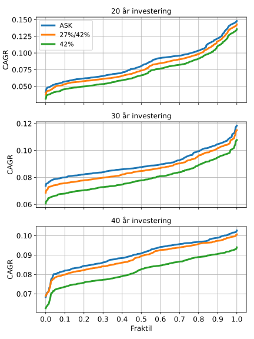
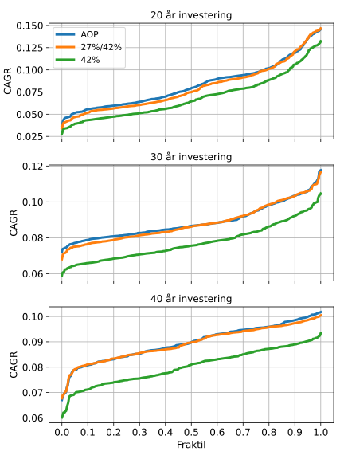
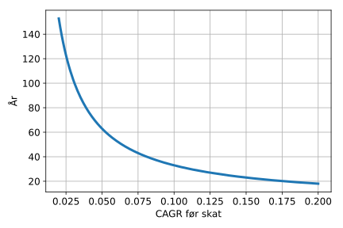

.. role:: python(code)
   :language: python

ASK og AOP vs realisationsbeskatning
====================================

*Brug ikke dette som finansiel rådgivning. Dette er kun en model.*

Aktiesparekonto (ASK) og aldersopsparing (AOP) har begge lave beskatningsprocenter på henholdsvis 17% og 15.3%,
men er tilgængelig lagerbeskattede.
I princippet vil realisationsbeskatning med aktiebeskatning på 27%/42% kunne give et højere afkast over en lang periode
pga renters rente.
Her vil der blive undersøgt hvor lang denne periode faktisk er.

Først skal den gevinst af depotterne kontrueres.
Her bliver der taget udgangspunk i data for S&P500 (fordi denne data er nemt tilgængelig), dataen er hentet fra, http://www.econ.yale.edu/~shiller/data/ie_data.xls, 16-11-2020.
Den procentvise stigning af ETFens kurs er nu den procentvise stigning af S&P500 plus det procentvise udbytte.
Se https://github.com/erikkjellgren/dkfinance_modeller/tree/main/docs/analyser/SP500.csv for den behandlede data.

Starter med at importere alle de moduler der skal bruges til modellen.

.. literalinclude:: ask_aop_vs_realisation.py
   :lines: 1-12

Depotterne er konstrueret med 0.0% ÅOP for at emulere det bedste scenarie for realisationsbeskatning.
Altså hvis man inverstere direkte i aktier istedet for at købe ETFer og investeringsforeninger.

Nu defineres depottet i modellen.

.. literalinclude:: ask_aop_vs_realisation.py
   :lines: 15-61

Her er der to forskellige realisationsbeskattede depoter. 
Det ene har 27%/42% beskatning med den fulde progræsionsgrænse,
dette er best-case for realisationsbeskatning og relevant hvis dette er det fulde depot.
Det andet har altid 42% beskatning og modellere at der er et sideliggende depot der bruger hele progræsionsgrænsen.
Dette vil være worst-case for realisationsbeskatning

Modellen bliver nu defineret.

.. literalinclude:: ask_aop_vs_realisation.py
   :lines: 64-116

Der sættes parametre til graferne.

.. literalinclude:: ask_aop_vs_realisation.py
   :lines: 119-126

Sammenligningen mellem ASK og realisationsbeskatning køres nu og plottes.

.. literalinclude:: ask_aop_vs_realisation.py
   :lines: 119-126

Dette giver følgende plot.

På grafen ses CAGR efter omkostninger for de tre forskellige depoter.
Alt efter hvor meget af progræsionsgrænsen der bliver opbrugt af andre depoter,
vil realisationsbeskatningen ligge mellem 27%/42% og 42%.
Det kan bemærkes at selv efter 40 år vil ASK være en fordel ifht. at inverstere realisationsbeskattet.

Sammenligningen mellem AOP og realisationsbeskatning køres nu og plottes.

.. literalinclude:: ask_aop_vs_realisation.py
   :lines: 144-158

Dette giver følgende plot.

Det kan straks bemærkes her at best-case for realisationsbeskatning giver ca. det samme afkast som AOP.
Her er der kun investeret 5300 DKK.
De fleste vil ikke kun have investeringsforeninger for 5300 DKK totalt, så den relevante linje for de fleste,
vil ligge meget tættere på 42% end på 27%/42%.

Det er ikke overraskende at ASK og AOP giver bedre afkast selv efter lange perioder +40 år.
Dette kan sammenlignes med hvad man får via. en gennemsnitsmodel.

Den simple form for lagerbeskatning er:

.. math::
   L = k\cdot\left(1+a\cdot\left(1-s\right)\right)^{y}

med :math:`k` start kapital, :math:`a` afkast per år, :math:`s` skatteprocent og :math:`y` år.

Den simple form for realisationsbeskatning er:

.. math::
   R = k\cdot\left(1+a\right)^{y}-\left(k\cdot\left(1+a\right)^{y}-k\right)\cdot q

med :math:`q` skatteporcent.

Disse to kan nu sættes ligmed hinanden for at finde hvilket år skiftet går ved:

.. math::
   \begin{eqnarray}
   k\cdot\left(1+a\cdot\left(1-s\right)\right)^{y}&=&k\cdot\left(1+a\right)^{y}-\left(k\cdot\left(1+a\right)^{y}-k\right)\cdot q \\
   k\cdot\left(1+a-a\cdot s\right)^{y}&=&k\cdot\left(\left(1+a\right)^{y}-\left(1+a\right)^{y}\cdot q+q\right) \\
   \left(1+a-a\cdot s\right)^{y}&=&\left(1+a\right)^{y}\cdot\left(1-q\right)+q
   \end{eqnarray}

Jeg tror at den ovenstående kan ses til at være en `transcendental equation <https://en.wikipedia.org/wiki/Transcendental_equation>`_, så den løses kun nummerisk herfra.

Definere nu ligningen således den løses approximativt og plotter løsningen:

.. literalinclude:: ask_aop_vs_realisation.py
   :lines: 161-192

Dette giver følgende plot.

Det kan ses at for CAGR (før skat) på 7.5% ville det tage lidt over 40 år før renters-rente fra realisationsbeskatning ville give en fordel.
Dette underbygger at for den komplicerede model at det findes at ASK "altid" kan betale sig.

Den totale model med analyse er.

.. literalinclude:: ask_aop_vs_realisation.py
   :lines: 1-192