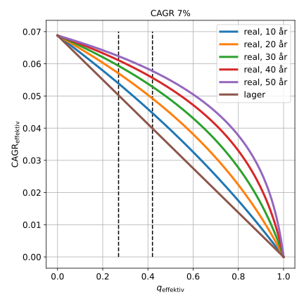
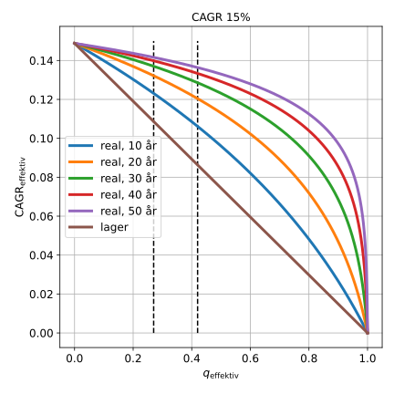

.. role:: python(code)
   :language: python

Estimat af CAGR efter skat og ÅOP
=================================

*Brug ikke dette som finansiel rådgivning. Dette er kun en model.*

Givet at man en idé om hvor meget ens strategi i gennemsnit giver per år, 
kan det være brugbart at estimere hvor meget dette vil svare til efter skat og ÅOP.
Dette estimat er forskelligt for lagerbeskatning og realisationsbeskatning.

Realisationsbeskatning udledning
################################

Kapital for et realisationsbeskattet depot er givet ved:

.. math::
   k'_{\mathrm{slut}}=k_{\mathrm{start}}\cdot\prod_{i=1}^{y}\left(1+a_{i}\right)-s\left(k_{\mathrm{start}}\cdot\left(\prod_{i=1}^{y}\left(1+a_{i}\right)-1\right)\right)

Her er :math:`a_{i}` procentielle afkast for det :math:`i`'te år,
og :math:`y` er antal år og :math:`s\left(x\right)` er en funktion der beregner skatten for :math:`x` afkast.
Det kan ses at:

.. math::
   k'_{\mathrm{start}}\cdot\left(\prod_{i=1}^{y}\left(1+a_{i}\right)-1\right)=k_{\mathrm{start}}\cdot\prod_{i=1}^{y}\left(1+a_{i}\right)-k_{\mathrm{start}}

Det er altså kapital der overstiger start kapitalen.
En simplificering kan nu laves med følgende definition:

.. math::
   \begin{eqnarray}
   \bar{a}&=&\left(\prod_{i=1}^{y}\left(1+a_{i}\right)\right)^{1/y}-1 \\
   \left(1+\bar{a}\right)^{y}&=&\prod_{i=1}^{y}\left(1+a_{i}\right)
   \end{eqnarray}

Det kan ses at dette er definitionen af CAGR.
Slut kapitalen kan nu skrives som:

.. math::
   k'_{\mathrm{slut}}=k_{\mathrm{start}}\cdot\left(1+\bar{a}\right)^{y}-s\left(k_{\mathrm{start}}\cdot\left(\left(1+\bar{a}\right)^{y}-1\right)\right)

Modregning af ÅOP kan gøres ved at trække ÅOP fra CAGR:

.. math::
   k_{\mathrm{slut}}=k_{\mathrm{start}}\cdot\left(1+\bar{a}-\mathrm{åop}\right)^{y}-s\left(k_{\mathrm{start}}\cdot\left(\left(1+\bar{a}-\mathrm{åop}\right)^{y}-1\right)\right)

I stedet for at have skatten som en funktion af overskud, kan skatten også beregnes som en effektiv skatteprocent ganget med overskuddet.
Den effektive skatteprocent kan beregnes som:

.. math::
   q_{\mathrm{effektiv}}=\frac{s\left(x\right)}{x}

Derfor:

.. math::
   q_{\mathrm{effektiv}}\cdot k_{\mathrm{start}}\cdot\left(\left(1+\bar{a}-\mathrm{åop}\right)^{y}-1\right)=s\left(k_{\mathrm{start}}\cdot\left(\left(1+\bar{a}-\mathrm{åop}\right)^{y}-1\right)\right)

Herved:

.. math::
   k_{\mathrm{slut}}=k_{\mathrm{start}}\cdot\left(1+\bar{a}-\mathrm{åop}\right)^{y}-q_{\mathrm{effektiv}}\cdot k_{\mathrm{start}}\cdot\left(\left(1+\bar{a}-\mathrm{åop}\right)^{y}-1\right)

Det kan nu huskes at CAGR også kan defineres som:

.. math::
   \mathrm{CAGR}=\left(\frac{k_{\mathrm{slut}}}{k_{\mathrm{start}}}\right)^{1/y}-1

Ligningen for slut kapitalen kan derfor omskrives til denne form:

.. math::
   \begin{eqnarray}
   \frac{k_{\mathrm{slut}}}{k_{\mathrm{start}}}&=&\left(1+\bar{a}-\mathrm{åop}\right)^{y}-q_{\mathrm{effektiv}}\cdot\left(\left(1+\bar{a}-\mathrm{åop}\right)^{y}-1\right) \\
   \left(\frac{k_{\mathrm{slut}}}{k_{\mathrm{start}}}\right)^{1/y}&=&\left(\left(1+\bar{a}-\mathrm{åop}\right)^{y}-q_{\mathrm{effektiv}}\cdot\left(\left(1+\bar{a}-\mathrm{åop}\right)^{y}-1\right)\right)^{1/y} \\
   \mathrm{CAGR_{effektiv}}&=&\left(\left(1+\bar{a}-\mathrm{åop}\right)^{y}-q_{\mathrm{effektiv}}\cdot\left(\left(1+\bar{a}-\mathrm{åop}\right)^{y}-1\right)\right)^{1/y}-1
   \end{eqnarray}

Slut udtrykket er nu:

.. math::
   \mathrm{CAGR_{effektiv}}=\left(\left(1-q_{\mathrm{effektiv}}\right)\cdot\left(1+\bar{a}-\mathrm{åop}\right)^{y}+q_{\mathrm{effektiv}}\right)^{1/y}-1
   :label: realisation

Lagerbeskatning udledning
#########################

Kapital for et lagerbeskattet depot efter et år er givet ved:

.. math::
   k'_{1}=k_{0}\cdot\left(1+a_{1}\right)-s\left(k_{0}\cdot a_{1}\right)

Igen ved at bruge den effektive skatteprocent:

.. math::
   \begin{eqnarray}
   k'_{1}&=&k_{0}\cdot\left(1+a_{1}\right)-q_{\mathrm{effektiv},1}\cdot k_{0}\cdot a_{1} \\
   &=&k_{0}\cdot\left(1+a_{1}-q_{\mathrm{effektiv},1}\cdot a_{1}\right)
   \end{eqnarray}

Kapital efter to år er givet ved:

.. math::
   k'_{2}=k'_{1}\cdot\left(1+a_{2}-q_{\mathrm{effektiv},2}\cdot a_{2}\right)

Ved at indsætte ligningen for kapital efter et år findes:

.. math::
   k'_{2}=k_{0}\cdot\left(1+a_{1}-q_{\mathrm{effektiv},1}\cdot a_{1}\right)\cdot\left(1+a_{2}-q_{\mathrm{effektiv},2}\cdot a_{2}\right)

Det kan derfor ses at det generelle udtryk er:

.. math::
   \begin{eqnarray}
   k'_{\mathrm{slut}}&=&k_{\mathrm{start}}\cdot\prod_{i=1}^{y}\left(1+a_{i}-q_{\mathrm{effektiv},i}\cdot a_{i}\right) \\
   &=&k_{\mathrm{start}}\cdot\prod_{i=1}^{y}\left(1+a_{i}\cdot\left(1-q_{\mathrm{effektiv},i}\right)\right)
   \end{eqnarray}

Igen kan ÅOP trækkes fra det procentielle afkast:

.. math::
   k_{\mathrm{slut}}=k_{\mathrm{start}}\cdot\prod_{i=1}^{y}\left(1+\left(a_{i}-\mathrm{åop}\right)\cdot\left(1-q_{\mathrm{effektiv},i}\right)\right)

Nu kan den effektive CAGR findes:

.. math::
   \begin{eqnarray}
   \frac{k_{\mathrm{slut}}}{k_{\mathrm{start}}}&=&\prod_{i=1}^{y}\left(1+\left(a_{i}-\mathrm{åop}\right)\cdot\left(1-q_{\mathrm{effektiv},i}\right)\right) \\
   \left(\frac{k_{\mathrm{slut}}}{k_{\mathrm{start}}}\right)^{1/y}&=&\left(\prod_{i=1}^{y}\left(1+\left(a_{i}-\mathrm{åop}\right)\cdot\left(1-q_{\mathrm{effektiv},i}\right)\right)\right)^{1/y} \\
   \mathrm{CAGR_{effektiv}}&=&\left(\prod_{i=1}^{y}\left(1+\left(a_{i}-\mathrm{åop}\right)\cdot\left(1-q_{\mathrm{effektiv},i}\right)\right)\right)^{1/y}-1
   \end{eqnarray}

For at få en brugbar formel bliver vi nød til at lave en approksimation nu.
Det kan approksimere at:

.. math::
   \prod_{i=1}^{y}\left(1+\left(a_{i}-\mathrm{åop}\right)\cdot\left(1-q_{\mathrm{effektiv},i}\right)\right)\approx\left(1+\left(\bar{a}-\mathrm{åop}\right)\cdot\left(1-\bar{q}_{\mathrm{effektiv}}\right)\right)^{y}

Dette er en approksimation of kun eksakt hvis alle :math:`a_{i}` er samme værdi og alle :math:`q_{\mathrm{effektiv},i}` er samme værdi.
Herved:

.. math::
   \widetilde{\mathrm{CAGR}}_{\mathrm{effektiv}}=\left(\left(1+\left(\bar{a}-\mathrm{åop}\right)\cdot\left(1-\bar{q}_{\mathrm{effektiv}}\right)\right)^{y}\right)^{1/y}-1

Tilden indikere at det er en approksimativ ligning.
Ligningen bliver derfor til sidst:

.. math::
   \widetilde{\mathrm{CAGR}}_{\mathrm{effektiv}}=\left(\bar{a}-\mathrm{åop}\right)\cdot\left(1-\bar{q}_{\mathrm{effektiv}}\right)
   :label: lager

Diskussion af ligninger
#######################

I ligningerne :eq:`realisation` og :eq:`lager` er :math:`\bar{a}` forventet gennemsnitligt årligt afkast før skat og ÅOP,
og :math:`q_{\mathrm{effektiv}}` er den effektiv skatteprocent, vil være mellem 27% og 42% for et normalt aktiedepot.

Det kan ses at ligningen for den effektive CAGR efter skat for et realisationsbeskattet depot er afhængig af antal år.
Lad os se hvordan den effektive CAGR afhænger af antal år for et givent afkast før skat over skatteprocenter mellem 0% og 100%.

Ovenstående graf viser ligningerne :eq:`realisation` og :eq:`lager`.
De stiplede linjer er 27% skat og 42% skat.
Det kan ses at den effektive CAGR for lagerbeskatning altid er mindre end den for realisationsbeskatning, hvilket er som forventet.
For et realisationsbeskattet depot vil den effektive CAGR gå mod CAGR før skat jo flere år der passere.
Dette er grundet *renters-rente* effekten man får ved realisationsbeskatning.

Et lignende plot kan laves, men nu med CAGR før skat på 15%.

Det kan bemærkes her at tendensen er den samme som for CAGR før skat på 7%,
men at den effektive CAGR hurtigere går mod CAGR før skat når antal år forøges.

For et lagerbeskattet depot vil den effektive CAGR være skatteprocenten mindre end CAGR før skat.
Hvor for et realisationsbeskattet depot vil den effektive CAGR afhænge af antal år der går,
og over tid komme tættere på CAGR før skat. 
Dette er accelereret af størrelse af CAGR før skat.

*Hvis du har fået værdi ud af denne analyse kan du støtte med* `en kop kaffe <https://www.buymeacoffee.com/erikrk>`_, *hvis du har lyst :)*

Python detaljer
###############

Starter med at importere alle de moduler der skal bruges til modellen.

.. literalinclude:: estimat_effektiv_cagr.py
   :lines: 1-2

Definere en funktion for ligning :eq:`realisation`:

.. literalinclude:: estimat_effektiv_cagr.py
   :lines: 5-17

Definere en funktion for ligning :eq:`lager`:

.. literalinclude:: estimat_effektiv_cagr.py
   :lines: 20-32

Sætter nogle graf parametre:

.. literalinclude:: estimat_effektiv_cagr.py
   :lines: 35-41

Laver graf for CAGR på 7% før skat og ÅOP for forskellige antal år:

.. literalinclude:: estimat_effektiv_cagr.py
   :lines: 43-60

Laver graf for CAGR på 15% før skat og ÅOP for forskellige antal år:

.. literalinclude:: estimat_effektiv_cagr.py
   :lines: 62-77

Det fulde script er:

.. literalinclude:: estimat_effektiv_cagr.py
   :lines: 1-77
