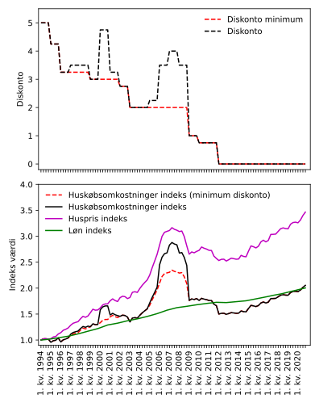
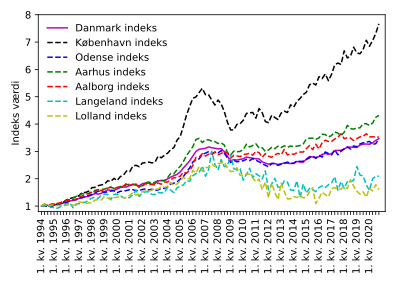
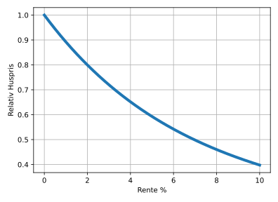

.. role:: python(code)
   :language: python

Huspriser og renter
===================

*Brug ikke dette som finansiel rådgivning. Dette er kun en model.*

Over de sidste 25 år har huspriserne i gennemsnit steget med en faktor 3.5.
Men hvilke drivere har være de primære til denne prisstigning, og kan disse fortsætte fremadrettet.
De primære drivere for stigning af huspriser er:

#. Renter på boliglån 
#. Lønstigninger
#. Forøgelse af belåningsgrad
#. Geografiske forskelle

I denne model vil belåningsgraden være antaget til at være konstant.
Givet at den er antaget at være konstant, så er den faktiske belåningsgrads ikke relevant.
Geografiske forskelle vil i første omgang ikke blive taget højde for, men vil til sidst blive diskuteret.

Modellen vil gøre brug af data fra 1994 og fremadrettet. 
Det er valgt at starte i 1994, da `mixlån <https://da.wikipedia.org/wiki/Mixl%C3%A5n>`_, blev afskaffet i 1993, og lånestrukturen derefter blev den vi kender igennem realkreditten.

Løn indeks konstruktion
#######################

Løn indekset er konstrueret ved at bruge data fra, `djoef.dk <https://www.djoef.dk/r-aa-dgivning/l-oe-n/l-oe-nforhandling/loenudvikling19922015forprivatansatte.aspx#IL-oe-nudvikling--19922016--for--privatansatte--dj-oe-fere>`_, 07-04-2021.
Her er tallene eksl. anciennitetsafledte brugt, og det er antaget at den annualiserede stigning har været den samme for alle fire kvartaler.

For 2016 1. kv., 2. kv. og 3. kv. er der ingen data i de to sæt løn indekset er baseret på.
Disse er derfor antaget til at være 2.1% annualiseret.

For perioden efter 2016 1. kv., er der hentet data fra `statistikbanken.dk <https://www.statistikbanken.dk/statbank5a/selectvarval/define.asp?PLanguage=0&subword=tabsel&MainTable=SBLON1&PXSId=214666&tablestyle=&ST=SD&buttons=0>`_, 07-04-2021.
Her er der valgt "Sektorer i alt" og "Erhverv i alt".

Det samlede sæt af annualiserede lønstigninger kan findes her, `loenstigning.txt <https://github.com/erikkjellgren/dkfinance_modeller/tree/main/docs/analyser/huspriser/loenstigning.txt>`_.

Lønstignings indekset er så konstrueret ved at starte ved 1, også stige hvert kvartal, med den kvartalvise stigning, fundet via.

.. math::
   s_\mathrm{kvartal} = \left( 1 + s_\mathrm{årlig} \right)^{3/12} - 1

Huspris indeks konstruktion
###########################

Huspris indekserne er taget fra `boliga.dk <https://www.boliga.dk/boligpriser>`_, 09-04-2021.

Indekset for `Danmark <https://www.boliga.dk/boligpriser/resultater?area=72000&type=0&data=0>`_,
`København <https://www.boliga.dk/boligpriser/resultater?area=77101&type=0&data=0>`_,
`Odense <https://www.boliga.dk/boligpriser/resultater?area=77461&type=0&data=0>`_,
`Aarhus <https://www.boliga.dk/boligpriser/resultater?area=77751&type=0&data=0>`_,
`Aalborg <https://www.boliga.dk/boligpriser/resultater?area=77851&type=0&data=0>`_,
`Lolland <https://www.boliga.dk/boligpriser/resultater?area=77360&type=0&data=0>`_ og
`Langeland <https://www.boliga.dk/boligpriser/resultater?area=77482&type=0&data=0>`_.

Indekserne er normeret således at 1. kv. 1994 er defineret til at være 1.

Huskøbsomkostninger indeks konstruktion
#######################################

Huskøbsomkostninger indekset er konstrueret med antagelse om 80% realkreditlån og 20% selvbetaling. 

For lånet skal der beregnes en total omkostning (lån + renter).
Der startes med at kigge hvor på hvor meget af lånet der er tilbage efter en måned:

.. math::
   k_{1}=k_{\mathrm{lån}}\left(1+r\right)-k_{\mathrm{afbetaling}}\left(1+r\right)

Lånet vokser med renten, :math:`r`, bemærk at renten også er indkulderet i afbetalingen, da det antages at der afbetales d. 1 i måneden,
hvor det tilbageværende kapital af lånet er for sidste dag i måneden, derfor "spares" noget af renten for måneden.

Efter to måneder vil der derfor være:

.. math::
   \begin{eqnarray}
   k_{2}&=&k_{1}\left(1+r\right)-k_{\mathrm{afbetaling}}\left(1+r\right) \\
   &=&\left(k_{\mathrm{l\mathring{a}n}}\left(1+r\right)-k_{\mathrm{afbetaling}}\left(1+r\right)\right)\left(1+r\right)-k_{\mathrm{afbetaling}}\left(1+r\right) \\
   &=&k_{\mathrm{l\mathring{a}n}}\left(1+r\right)^{2}-k_{\mathrm{afbetaling}}\left(1+r\right)^{2}-k_{\mathrm{afbetaling}}\left(1+r\right) \\
   \end{eqnarray}

Det kan nu ses at det generalle udtryk derfor er:

.. math::
   k_{n}=k_{\mathrm{\mathrm{lån}}}\left(1+r\right)^{n}-k_{\mathrm{afbetaling}}\sum_{l=1}^{n}\left(1+r\right)^{l}

Det vides at den geometriske serie er givet ved:

.. math::
   \sum_{l=0}^{n-1}x^{l}=\left(\frac{1-x^{n}}{1-x}\right)

Denne kan skrives om til:

.. math::
   \sum_{l=1}^{n}x^{l}=\left(\frac{1-x^{n}}{1-x}\right)-1+x^{n}

Ved at :math:`x\rightarrow 1+r` findes det nu at:

.. math::
   k_{n}=k_{\mathrm{lån}}\left(1+r\right)^{n}-k_{\mathrm{afbetaling}}\left(\left(\frac{1-\left(1+r\right)^{n}}{-r}\right)-1+\left(1+r\right)^{n}\right)

Lånet vil være tilbage betalt når :math:`k_{n}=0`:

.. math::
   0=k_{\mathrm{lån}}\left(1+r\right)^{n}-k_{\mathrm{afbetalling}}\left(\left(\frac{1-\left(1+r\right)^{n}}{-r}\right)-1+\left(1+r\right)^{n}\right)

Den månedelige afbetaling bliver nu:

.. math::
   k_{\mathrm{afbetalling}}=\frac{k_{\mathrm{lån}}\left(1+r\right)^{n}}{\left(\frac{1-\left(1+r\right)^{n}}{-r}\right)-1+\left(1+r\right)^{n}}

Den totale omkostning (lån + renter) ved lånet er nu:

.. math::
   k_{\mathrm{total}}=\frac{k_{\mathrm{lån}}\left(1+r\right)^{n}\cdot n}{\left(\frac{1-\left(1+r\right)^{n}}{-r}\right)-1+\left(1+r\right)^{n}}

Modellen for omkostningskorrigeret huspris vil derfor blive:

.. math::
   \begin{eqnarray}
   k_{\mathrm{omkostning}} &=& \frac{0.8k_{\mathrm{huspris}}\left(1+r\right)^{n}\cdot n}{\left(\frac{1-\left(1+r\right)^{n}}{-r}\right)-1+\left(1+r\right)^{n}}+0.2k_{\mathrm{huspris}} \\
   &=& \left(\frac{0.8\left(1+r\right)^{n}\cdot n}{\left(\frac{1-\left(1+r\right)^{n}}{-r}\right)-1+\left(1+r\right)^{n}}+0.2\right)k_{\mathrm{huspris}}
   \end{eqnarray}
   :label: omkostning

Indekset er herefter normeret således at det er 1, ved 1. kv. 1994.

Til at estimere realkreditlåns renten er diskontoen brugt som proxy. 
Dataen for diskontoen er taget fra  `nationalbanken.statistikbank.dk <https://nationalbanken.statistikbank.dk/nbf/98214>`_.
Den hentede data kan findes her `diskonto.txt <https://github.com/erikkjellgren/dkfinance_modeller/tree/main/docs/analyser/huspriser/diskonto.txt>`_.

.. _diskussion2:

Diskussion af resultater
########################

Resultaterne af modellen kan ses i nedenstående graf, bemærk at basis huskøbsomkostninger indekset og huspris indekset er baseret på huspriserne for hele Danmark.

Det kan ses med det samme at hus priserne er steget markant siden 1994.
Dog kan vi se at huskøbsomkostninger indekset følger løn indekset over hele perioden, undtaget omkring 2007, som vi nu ved var en boligboble.
Modellen fanger altså boligpriserne var for høje i den periode.

Forskellen mellem huskøbsomkostninger indekset og huspris indekset kan tolkes til at være den rente-drevne stigning af boligpriserne.
Her skal det husket at renterne nu er så lave at de ikke kan forventes at falde fremadrette, så ud fra denne model kan det altså ikke forventes at boligpriserne vil fortsætte med at være så eksplosive.

Hvis renterne forventes at blive ved med at være tæt på nul det næste lange stykke tid, er der til gengæld heller ikke noget evidens for at boligmarkedet som aggregat er i en boble.

En vigtig men skjult antagelse i modellen er at den indirekte antager at alting var korrekt prissat i 1. kv. 1994. 
Denne antagelse er dog desværre svær at komme uden om.

Indtil videre er der ikke taget højde for geografiske effekter i boligpriserne.

Som det tydeligt kan ses har geografien kæmpe betydning for udviklingen af boligpriserne.
Områder som Lolland og Langeland, som generelt anses til at være udkants Danmark oplever stagnerede huspriser, hvor København til gengæld oplever meget hurtigt voksende boligpriser.

En mulig forklaring på dette kunne være affolkning af udkantsområderne og tilflytning til de stører byer.
Om denne tese kan underbygges med data vil dog ikke undersøges i denne analyse.

En ting der kan bemærkes er dog at de tre næststørste byer (Aarhus, Aalborg og Odense), ligger omkring landsgennemsnittet i boligprisstigninger.
Hvilket kan tolkes til at det kun er København der oplever urbaniserings-effekten, eller at huspriserne kunne være for høje i København.
Den præsenterede model kan dog ikke sige noget specifikt om København.

I modellen er effekten af renter med taget eksplicit.
Så til sidst lad os kigge på hvad rente-stigninger kunne betyde for boligpriserne.

Ved at starte fra ligning :eq:`omkostning` kan det ses i modellen at huspriserne afhænger af renterne på følgende måde:

.. math::
   k_{\mathrm{huspris}}=k_{\mathrm{omkostning}}\left(\frac{0.8\left(1+r\right)^{n}\cdot n}{\left(\frac{1-\left(1+r\right)^{n}}{-r}\right)-1+\left(1+r\right)^{n}}+0.2\right)^{-1}

Dette kan nu plottes:

I ovenstående figur kan husprisernes afhængighed af renten ses, givet at man har et budget til alle omkostning på 1.

Det kan ses at hvis renterne stiger "permanent" 2% vil priserne falde 20%, og hvis der er en "permanent" stigning på 4% vil priserne falde 35%.

Dette er selvfølgelig ikke overraskende, ved en belåningsgrad på 80% har renterne stor indflydelse på hvor meget man har råd til at låne.

*Hvis du har fået værdi ud af denne analyse kan du støtte med* `en kop kaffe <https://www.buymeacoffee.com/erikrk>`_, *hvis du har lyst :)*

.. _pythondetaljer3:

Python detaljer
###############

Starter med at importere alle de moduler der skal bruges til modellen.

.. literalinclude:: huspriser.py
   :lines: 1-6
   
Konstruere huspris indekset og løn indekset.

.. literalinclude:: huspriser.py
   :lines: 8-24

Konstruere omkostning indekset.

.. literalinclude:: huspriser.py
   :lines: 26-36

Bygger graferne.

.. literalinclude:: huspriser.py
   :lines: 38-114

Hele scriptet er.

.. literalinclude:: huspriser.py
   :lines: 1-114
