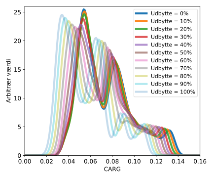
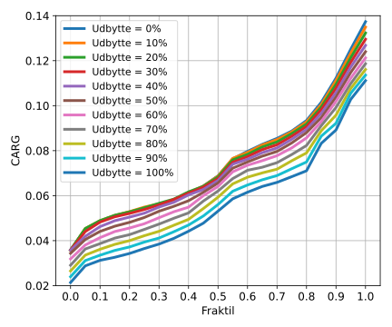

.. role:: python(code)
   :language: python

Danske investeringsforeninger, signifikans af udbytte
======================================================

*Brug ikke dette som finansiel rådgivning. Dette er kun en model.*

Her vil det undersøges hvor står betydning udbytte procenten har for Danske investeringsforeninger der ellers realisationsbeskattes.

Først skal den indre værdi af ETFen kontureres.
Her bliver der taget udgangspunk i data for S&P500 (fordi denne data er nemt tilgængelig), dataene er hentet fra, http://www.econ.yale.edu/~shiller/data/ie_data.xls, 16-11-2020.
Den procentvise stigning af ETFens kurs er nu den procentvise stigning af S&P500 plus det procentvise udbytte.
Se https://github.com/erikkjellgren/dkfinance_modeller/tree/main/docs/analyser/SP500.csv for den behandlede data.

Starter med at importere alle de moduler der skal bruges til modellen.

.. literalinclude:: investeringsforening_udbytte.py
   :lines: 1-12

Nu defineres depotet i modellen.

.. literalinclude:: investeringsforening_udbytte.py
   :lines: 15-32

Her er ÅOP valgt til at være 0.55% for at være en normal værdi for en Dansk investeringsforening.
Depotet defineres inde i en funktion for at den senere er nemmere at nulstille.

Nu kan propagationen for modellen bygges.

.. literalinclude:: investeringsforening_udbytte.py
   :lines: 34-57
   
Den statistiske samling af slut depotbeholdninger samles ved at startet 600 forskellige måneder, startende fra 1949 December,
og propagere 20 år frem for hver start måned.
Dette gøres for kursstigning til udbytteprocent mellem 0% og 100%.
Det effektive udbytte for bliver opgjort på årlig basis efter følgende model:

.. math::
  u_\mathrm{effektive} = u + \max\left(0, pk\right)

Med :math:`u` værende udbytte, :math:`k` værende kursstigning og 
:math:`p` værende den kursstigning til udbytteprocent.
Efter at have propageret 20 år frem gemmes den total depotværdi efter skat.

Efter at koden er kørt kan dataene analyseres.
Først sættes nogle graf parametre.

.. literalinclude:: investeringsforening_udbytte.py
   :lines: 59-66

For de forskellige udbytte procenter kan fordelingen af slut værdien af depotet plottes.

.. literalinclude:: investeringsforening_udbytte.py
   :lines: 68-86

Dette giver følgende plot.

Man kan se at jo højere udbytte procenten er jo lavere vil afkastet være over en 20 årig periode.
Det skal specielt bemærkes at ved de lave udbytte procenter findes der situationer hvor man kan have haft et meget stort afkast
(hvis man er heldig).
0.03 CAGR ift. 0.14 CAGR.
Dette giver et hint af at realisationsbeskatning vil have en fordel i perioder med stærk vækst,
ift. udbytte beskattet afkast.

For de forskellige udbytte procenter kan fraktilerne af slut værdien af depotet plottes.

.. literalinclude:: investeringsforening_udbytte.py
   :lines: 89-105

Dette giver følgende plot.

Det kan bemærkes at op til 0.5 fraktilen er alle udbytteprocenter mellem 0% til 30% næsten identiske.
Det er primært ved de "heldige" start tidspunkter at en udbytte procent lavere end 30% vil give en forskel.
Ved udbytte procenter over 30% falder afkastet relativt hurtigt.
Givet at udbytteprocenter mellem 0% og 30% giver forholdsvis ens afkast i halvdelen af tilfældene, 
vil en udbytteprocent på 30% i fremtidige analyse af Danske investeringsforeninger være et brugbart estimat.
30% udbytte er også fundet til at være gennemsnittet af Danske investeringsforening, se https://www.reddit.com/r/dkfinance/comments/hv82ll/en_gang_for_alle_om_etfer_vs_danske/.
   
Den totale model med analyse er.

.. literalinclude:: investeringsforening_udbytte.py
   :lines: 1-105
