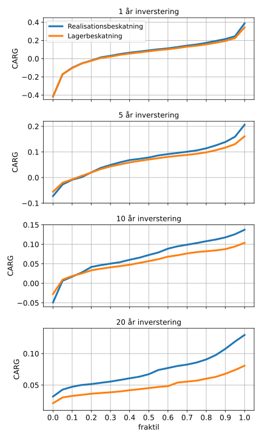
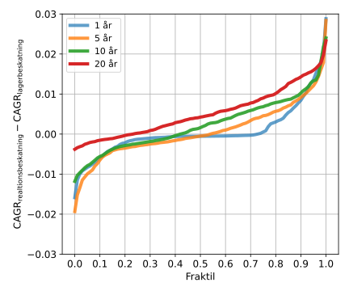

.. role:: python(code)
   :language: python

Danske investeringsforeninger vs. ETFer beskatning
===================================================

*Brug ikke dette som finansiel rådgivning. Dette er kun en model.*

Nogen Danske investeringsforeninger er realisationsbeskattet givet at de udfylde kriterier
vedrørende udbetaling af udbytte.
Modellen for udbytte fra investeringsforeningerne kan ses i :ref:`Danske investeringsforeninger, signifikans af udbytte`.
Denne sammenligning realisationsbeskattede investeringsforeninger ifht. ETFer bruger priser fra Saxo.
Investeringsforening er antaget en ÅOP på 0.55%.
ETFen er der antaget en ÅOP på 0.12% og brug af underkonto i Euro.

Den underliggende historiske data følger S&P500, dataene er hentet fra, http://www.econ.yale.edu/~shiller/data/ie_data.xls, 16-11-2020.
Se https://github.com/erikkjellgren/dkfinance_modeller/tree/main/docs/analyser/SP500.csv for den behandlede data.

Modellen kan nu opbygges.
Starter med at importere alle de moduler der skal bruges til modellen.

.. literalinclude:: lager_vs_realisation.py
   :lines: 1-12

Nu defineres depotet i modellen.

.. literalinclude:: lager_vs_realisation.py
   :lines: 15-41

Depoterne defineres inde i en funktion for at de senere er nemmere at nulstille.

Nu kan propagationen for modellen bygges.

.. literalinclude:: lager_vs_realisation.py
   :lines: 44-86

Den statistiske samling af slut depotbeholdninger samles ved at starte X forskellige måneder, startende fra 1949 December,
og propagere 1, 5, 10 eller 20 år frem for hver start måned.

Efter at koden er kørt kan dataene analyseres.
Først sættes nogle graf parametre.

.. literalinclude:: lager_vs_realisation.py
   :lines: 88-95
   
For de forskellige depoter og antal investerings år kan 
fraktilerne af slut værdien af depotet plottes.

.. literalinclude:: lager_vs_realisation.py
   :lines: 97-126

Dette giver følgende plot.

I figuren kan den totale værdi af depotet opgjort som CAGR efter skat ses.
For en investeringsperiode på under 5 år kan det ses at der stort set ingen forskel er 
mellem at vælge en Dansk investeringsforening eller en ETF.
For 1 år perioden kan det bemærkes at der er 30% risiko for at man har et tab!
For investerings perioder længere end 10 år vil realisationsbeskatning give
en gevinst ifht. billigere (læs: lavere ÅOP) ETFer i ca. halvdelen af tilfældene.

Forskellen mellem CAGR fra realisationsbeskatning og lagerbeskatning kan også sammenlignes.

.. literalinclude:: lager_vs_realisation.py
   :lines: 128-146

Dette giver følgende plot.

Det kan her tydeligt ses at jo længere investeringshorisonten er, jo bedre er realisationsbeskatning.

Den totale model med analyse er.

.. literalinclude:: lager_vs_realisation.py
   :lines: 1-146
