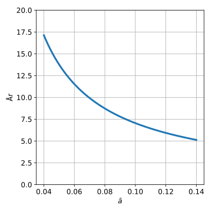

.. role:: python(code)
   :language: python

Øvregrænse for skatteoptimering
===============================

*Brug ikke dette som finansiel rådgivning. Dette er kun en model.*

For et realisationsbeskattet depot vil depot-værdien efter :math:`y` år være givet ved:

.. math::
   D_{y}\left(k,\left\{ a_{i}\right\} \right)=k\cdot\prod_{i=1}^{y}\left(1+a_{i}\right)-s_{p,q,g,y}\left(k\cdot\prod_{i=1}^{y}\left(1+a_{i}\right)-k,\left\{ r_{i}\right\} \right)

:math:`k` er start kapital, :math:`\left\{ a_{i}\right\}`  er et sæt af årlige afkast og :math:`y` er antal år.
Her er skatten givet ved:

.. math::
   s_{p,q,g,y}\left(x,\left\{ r_{i}\right\} \right)=p\cdot\min\left(x,g\cdot\prod_{i=1}^{y}\left(1+r_{i}\right)\right)+q\cdot\max\left(0,x-g\cdot\prod_{i=1}^{y}\left(1+r_{i}\right)\right)

Med :math:`x` er kapital der skal beskattes, :math:`p` værende den lavere procentsats, :math:`q` værende det højere procentsats, :math:`g` er progræsionsgrænsen og :math:`\left\{ r_{i}\right\}`  er et sæt af procentielle stigninger af progræssionsgrænsen.
Da depot-værdien medregnet skat kun afhænger af startværdien og slutværdien af depotet, derfor:

.. math::
   \prod_{i=1}^{y}\left(1+x_{i}\right)=\left(1+\bar{x}\right)^{y}

Det fåes derfor at:

.. math::
   D_{y}\left(k,\bar{a}\right)=k\cdot\left(1+\bar{a}\right)^{y}-s_{p,q,g,y}\left(k\cdot\left(1+\bar{a}\right)^{y}-k,\bar{r}\right)

med:

.. math::
   s_{p,q,g,y}\left(x,\bar{r}\right)=p\cdot\min\left(x,g\cdot\left(1+\bar{r}\right)^{y}\right)+q\cdot\max\left(0,x-g\cdot\left(1+\bar{r}\right)^{y}\right)

Givet et depot der giver et afkast, kan afkastet realiseres eller forblive urealiseret, dette giver to situationer for afkastet fra depottet.
Hvis depottet realiseres vil delen fra afkastet udvikle sig følgende:

.. math::
   \begin{eqnarray}
   D_{\mathrm{realiseret}} &=& \left.D_{y}\left(m\cdot k,\bar{a}\right)\right|_{g=g_{\mathrm{effektiv}}} \\
	                       &=& m\cdot k\cdot\left(1+\bar{a}\right)^{y}-s_{p,q,g_{\mathrm{effektiv}},y}\left(m\cdot k\cdot\left(1+\bar{a}\right)^{y}-m\cdot k,\bar{r}\right)
    \end{eqnarray}

Her er :math:`m` en minus skatteprocenten betalt vel realisering og :math:`g_{\mathrm{effektiv}}` er progræssionsgrænsen modregnet den del af progræssionsgrænsen der bliver opbrugt af det underligende depot.
Den anden situtation er at afkastet forbliver urealiseret, dette depot vil udvikle sig følgende:

.. math::
   \begin{eqnarray}
   D_{\mathrm{urealiseret}} &=& D_{y}\left(k,\bar{a}\right)+s_{p,q,g,y}\left(k\cdot\left(1+\bar{a}\right)^{y}-k,\bar{r}\right)-s_{p,q,g_{\mathrm{effektiv}},y}\left(k\cdot\left(1+\bar{a}\right)^{y},\bar{r}\right) \\
	                       &=& k\cdot\left(1+\bar{a}\right)^{y}-s_{p,q,g_{\mathrm{effektiv}},y}\left(k\cdot\left(1+\bar{a}\right)^{y},\bar{r}\right)
    \end{eqnarray}

Bemærk her at der vil blive betalt skat af hele depotet, da “start kapitalen” er urealiseret.
I situationen hvor det underliggende depot bruger hele progræssionsgrænsen vil skatten være givet ved:

.. math::
   \left.s_{p,q,0,y}\left(x,\bar{r}\right)\right|_{x>0}=q\cdot x

Antal år der skal gå før realisering for at denne skatteoptimering ikke kan betale sig, kan findes ved at sætte:

.. math::
   \begin{eqnarray}
   \left.D_{\mathrm{urealiseret}}\right|_{g_{\mathrm{effektiv}}=0} &=& 	\left.D_{\mathrm{realiseret}}\right|_{g_{\mathrm{effektiv}}=0} \\
   k\cdot\left(1+\bar{a}\right)^{y}-q\cdot k\cdot\left(1+\bar{a}\right)^{y} &=& m\cdot k\cdot\left(1+\bar{a}\right)^{y}-q\cdot\left(m\cdot k\cdot\left(1+\bar{a}\right)^{y}-m\cdot k\right) \\
   \left(1+\bar{a}\right)^{y}\cdot\left(k-q\cdot k\right) &=& \left(1+\bar{a}\right)^{y}\cdot\left(m\cdot k-q\cdot m\cdot k\right)+q\cdot m\cdot k \\
   \left(1+\bar{a}\right)^{y}\cdot\left(k-q\cdot k-m\cdot k+q\cdot m\cdot k\right) &=& q\cdot m\cdot k \\
   \left(1+\bar{a}\right)^{y} &=& \frac{q\cdot m\cdot k}{k-q\cdot k-m\cdot k+q\cdot m\cdot k} \\
   y\cdot\log\left(1+\bar{a}\right) &=& \log\left(\frac{q\cdot m\cdot k}{k-q\cdot k-m\cdot k+q\cdot m\cdot k}\right) \\
   y &=& \frac{\log\left(\frac{q\cdot m\cdot k}{k-q\cdot k-m\cdot k+q\cdot m\cdot k}\right)}{\log\left(1+\bar{a}\right)} \\
   y &=& \frac{\log\left(\frac{q\cdot m}{1-q-m+q\cdot m}\right)}{\log\left(1+\bar{a}\right)}
   \end{eqnarray}
   :label: oevregraense

Den ovenstående ligning er en øvregrænse for hvornår skatteoptimering kan betale sig.
Her det kan bemærkes at samme ligning fåes med :math:`g_{\mathrm{effektiv}}=\infty`, altså hvis progræssionsgrænsen ikke nåes.
For denne progræsionsgrænse vil :math:`q\rightarrow p`, og :math:`m=1-p` og derved fåes:

.. math::
   \begin{eqnarray}
   y &=& \frac{\log\left(\frac{p\cdot\left(1-p\right)}{1-p-\left(1-p\right)+p\cdot\left(1-p\right)}\right)}{\log\left(1+\bar{a}\right)} \\
    &=& \frac{\log\left(\frac{p\cdot\left(1-p\right)}{1-p+1+p+p\cdot\left(1-p\right)}\right)}{\log\left(1+\bar{a}\right)} \\
    &=& \frac{\log\left(\frac{p\cdot\left(1-p\right)}{p\cdot\left(1-p\right)}\right)}{\log\left(1+\bar{a}\right)} \\
    &=& \frac{\log\left(1\right)}{\log\left(1+\bar{a}\right)} \\
    &=& 0
   \end{eqnarray}

Den nedre grænse er derfor 0 år, og derfor ikke særlig brugbar.
Den øvregrænse fra ligning :eq:`oevregraense` kan nu plottes.

Ofte vil det ikke kunne betale sig at lave skatteoptimering hvis der er mere end 10 år til man skal bruge pengene.

Koden til plottet er:

.. literalinclude:: skatteoptimering_limit.py
   :lines: 1-41

