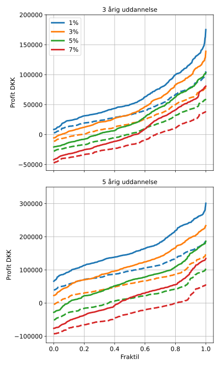

.. role:: python(code)
   :language: python

Investering af SU lån
=====================

*Brug ikke dette som finansiel rådgivning. Dette er kun en model.*

Under uddannelse er det muligt at tage SU-lån.
Hvis man tager SU-lån kun til investering, hvad kan man så forvente efter lånet er blevet tilbage betalt?
Dette vil blive undersøgt i den følgende model.

Model beskrivelse
#################

For modellen er følger den underliggende historiske data S&P500, dataene er hentet fra, http://www.econ.yale.edu/~shiller/data/ie_data.xls, 16-11-2020.
Se https://github.com/erikkjellgren/dkfinance_modeller/tree/main/docs/analyser/SP500.csv for den behandlede data.

To forskellige længder optagelse af lån hver måned bliver simuleret, 3 år og 5 år. 
5 år er repræsentativ for en bachelor + kandidat uddannelse.
I praktisk er der 1 måned mellem bachelor og kandidat hvor man ikke er under uddannelse, og burde have en rente derefter. 
Denne periode er negligeret i modellen, og det vil blive regnet som om at de 5 år er en lang uddannelse. 

Under uddannelse er renten 4%, hvorefter den er X% i modellen.
Lige nu er renten på SU lån efter uddannelse 1%, men lånet er ikke fast forrentet, så det kan i princippet ændre sig i fremtiden.

Afbetalingen af SU lånet er regnet således at det lige præcis vil gå op til den givne afbetalingsperiode (der afhænger af størrelsen af lånet).

Fra renterne på SU lånet vil der være 27% rente-fradrag.

For alle X% renter, vil der blive simuleret en best-case situation og en worst-case situation.
Best-case er hvor hele progressionsgrænsen for aktie-beskatningen er tilgængelig til det investerede beløb fra lånet.
Worst-case er hvor det er antaget af hele progressionsgrænsen er opbrugt af andre investeringer, således vil beløbet fra SU-lånet blive beskattet med 42% aktie-beskatningen.
I modellen antages det at der bliver investeret i en lagerbeskattet ETF.

Diskussion af resultater
########################

Resultaterne af modellen kan ses i nedenstående graf.

Ovenstående graf viser det forventede afkast efter tilbagebetaling af SU lånet.
De 'fulde' linjer er hvor den fulde progressionsgrænse (for aktie-beskatningen) vil være tilgængelig til SU lånet.
Den stiplede linje er hvor hele progressionsgrænse er brugt andet sted.
De forskellige farver repræsentere renten på lånet efter afsluttet uddannelse.

Givet at investerings perioden er ~20 år, og at dem som vælger at investere SU lån formentlig også har andre investeringer vil den følgende diskussion fokusere på de stiplede linjer.

For begge uddannelseslængder vil det historisk altid kunne betale sig at tage SU lån til investering givet en rente på 1% efter afsluttet uddannelse.

Man skal bemærke at jo kortere uddannelsen er, jo større er risiko, da afbetalingsperioden vil være kortere.
Dette kan ses ved at hvis renten stiger til bare 3%, vil der være ~20% risiko for tab ved at investere SU lånet over en 3 årig uddannelse.
Hvor investering af lånet over en 5 årig uddannelse, først vil have risiko for tab ved renter over 3%, givet at aktiemarkedet opfører sig som det har gjort historisk.

Givet den lange investeringshorisont der kommer med investering af et SU lån, er den største risiko, rente risikoen.
Selvom det renten ikke vil se ud til at stige de kommende år, kan det være svært at vide hvad der vil ske bare 5 år ud i fremtiden.
Hvilket kan have stor betydning, da SU lån ikke er fast-forrentet. 

*Hvis du har fået værdi ud af denne analyse kan du støtte med* `en kop kaffe <https://www.buymeacoffee.com/erikrk>`_, *hvis du har lyst :)*

.. _pythondetaljer2:

Python detaljer
###############

Starter med at importere alle de moduler der skal bruges til modellen.

.. literalinclude:: sulaan_investering.py
   :lines: 1-12

Nu defineres depotetterne i modellen.

.. literalinclude:: sulaan_investering.py
   :lines: 15-44

Ittererer over de forskellige kombinationer af antal år og renter, samt alle de forskellige tidsperioder.

.. literalinclude:: sulaan_investering.py
   :lines: 47-57

Hvis den totale værdi af aktiedepotet er større end afdraget på lånet, vil afdraget blive trukket ud.
Og depotet vil propageres.

.. literalinclude:: sulaan_investering.py
   :lines: 58-63

Ellers vil tab blive forøget med størrelsen af afdraget.
Hvis det er første gange vil tabet blive modregnet værdi af aktiedepotet.

.. literalinclude:: sulaan_investering.py
   :lines: 64-67

Samme som ovenstående, men for worst-case depotet.

.. literalinclude:: sulaan_investering.py
   :lines: 68-77

Forøger progressionsgrænsen med 2% hvert år.

.. literalinclude:: sulaan_investering.py
   :lines: 78-79

Etfer lånet er fuldt afdraget bliver totalt tab eller gevinst udregnet og gemt.

.. literalinclude:: sulaan_investering.py
   :lines: 81-88

Konstruere grafen af den indsamlede data.

.. literalinclude:: sulaan_investering.py
   :lines: 90-142

Det totale script er:

.. literalinclude:: sulaan_investering.py
   :lines: 1-142

